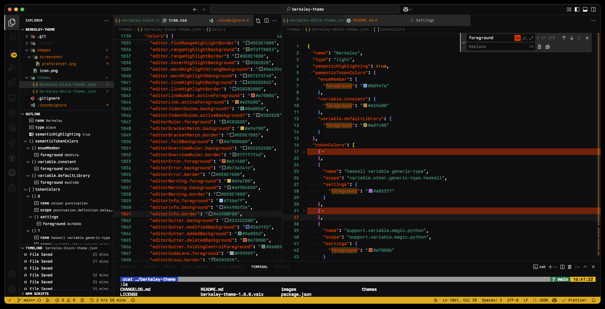
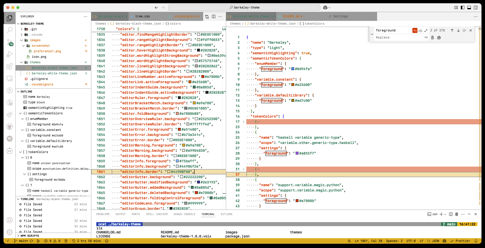

# berkeley-theme


Inspired by https://usgraphics.com/

## Marketplace

https://marketplace.visualstudio.com/items?itemName=ocat.berkeley-theme

## Screenshots




## Recommend Font

https://usgraphics.com/products/berkeley-mono

settings.json

```json
...
"editor.fontFamily": "Berkeley Mono",
"terminal.integrated.fontFamily": "Berkeley Mono, Hack Nerd Font",
...
```

## Contributing

Contributions are welcome.

admin dashboard
https://marketplace.visualstudio.com/manage/publishers/ocat

## Publish

```bash
commit...

vsce publish patch
vsce publish minor
vsce publish major
```

## License

MIT License
